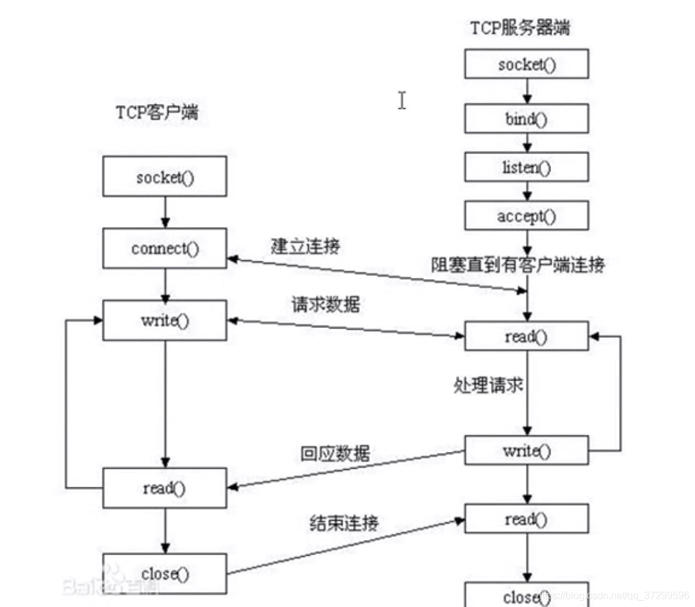

## TCP通信流程分析

### server:
1. `socket()`   创建socket
2. `bind()`     绑定服务器地址结构
3. `listen()`   设置监听上限
4. `accept()`   阻塞监听客户端连接
5. `read(fd)`   读取socket获取客户端数据
6. `write(fd)`  写到指定位置
7. `close` 

### client:
1. `socket()`   创建socket
2. `connect()`  与服务器建立连接
3. `write()`    写数据到socket
4. `read()`     读转换后的数据
5. 显示读取结果
6. `close()`

### socket(套接字):
1. Linux特殊文件类型(管道，套接字，字符设备，块设备)，不占用实际存储空间(伪文件)
2. 文件描述符fd，索引两个缓冲区(读，写)
3. 成对出现(C/S或B/s)
4. 捆绑IP,端口号(网络)

### sockaddr_in结构体
1. sin_family指代协议族，在socket编程中只能是AF_INET

2. sin_port存储端口号（使用网络字节顺序）

3. sin_addr是一个结构体:in_addr,它只有一个成员s_addr存储IP地址

4. sin_zero是为了让sockaddr与sockaddr_in两个数据结构保持大小相同而保留的空字节

---

---

## 三次握手四次挥手

### 三次挥手:
1. 主动发起连接请求端，发送SYN标志位，请求建立连接。携带数据包包号、数据字节数(0)、滑动窗口大小。
2. 被动接受连接请求端，发送ACK标志位，同时携带数据包包号、数据字节数(0)、滑动窗口大小。
3. 主动发起连接请求端，发送ACK标志位，应答服务器连接请求。携带确认序号。
   
### 四次挥手:
1. 主动关闭连接请求端，发送FIN标志位。
2. 被动关闭连接请求端，应答ACK标志位。----------------**半关闭完成**
   
3. 被动关闭连接请求端，发送FIN标志位。
4. 主动关闭连接请求端，应答ACK标志位。----------------**连接全部关闭**

### 滑动窗口:
    发送给连接对端，本端的缓冲区大小(实时)，保证数据不会丢失
****

## select实现IO多路转接思路

1. `lfd = socket();`          创建套接字
2. `bind();`                  绑定地址结构
3. `listen();`                设置监听上限
4. `fd_set rest,allset;`             创建r监听集合
5. `FD_ZERO(&rest);`          将r监听集合清空 
6. `FD_SET(lfd,&rset);`       将lfd添加至集合中
7. `ret = select(lfd+1,&rset,NULL,NULL,NULL);`监听文件描述符集合对应事件